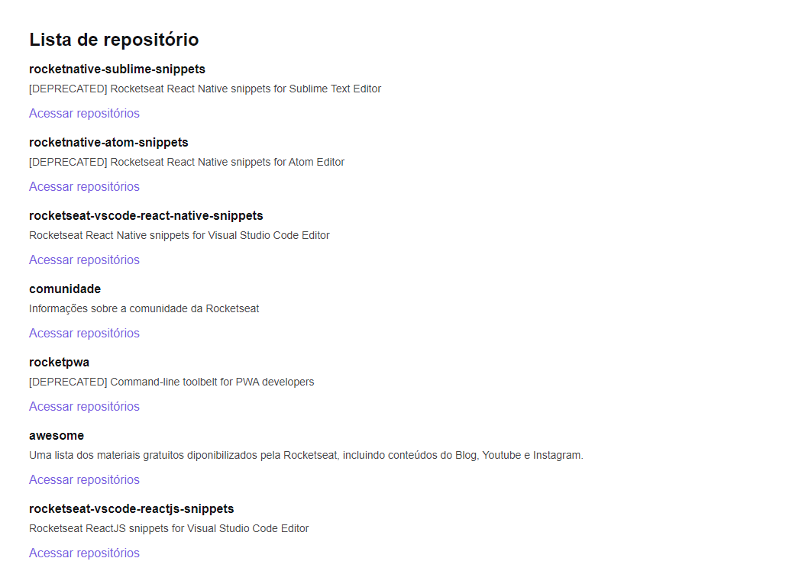

<div align="center" id="top"> 
  

&#xa0;

</div>

<h1 align="center">Ignite Chapter 1 - ReactJS</h1>
<h2 align="center">Github Explorer</h2>

<p align="center">
  

  

  

  

</p>

<p align="center">
  <a href="#dart-sobre">Sobre</a> &#xa0; | &#xa0; 
  <a href="#sparkles-o-que-foi-aprendido">O que foi aprendido</a> &#xa0; | &#xa0;
  <a href="#rocket-tecnologias">Tecnologias</a> &#xa0; | &#xa0;
  <a href="#white_check_mark-pré-requesitos">Pré requisitos</a> &#xa0; | &#xa0;
  <a href="#checkered_flag-começando">Começando</a> &#xa0; | &#xa0;
  <a href="#film_strip-demonstração">Demo</a> &#xa0; | &#xa0;
  <a href="#memo-licença">Licença</a> &#xa0; | &#xa0;
  <a href="https://github.com/cleber-santos" target="_blank">Autor</a>
</p>

<br>

## :dart: Sobre

Primeiro projeto criado no Ignite - trilha ReactJS.
Onde criamos uma lista de repositorios da rocketseat, consumindo uma API do github. Projeto simples onde foi ensinado os primeiros fundamentos e toda a estrutura de uma aplicação React.

## :sparkles: O que foi aprendido

- [x] Webpack Dev Server;
- [x] Ambiente de desenvolvimento e ambiente de produção;
- [x] Importação de arquivos css e sass;
- [x] Criação de componentes;
- [x] Conceito de imutabilidade;
- [x] Como funciona os "hooks", useState e useEffect;
- [x] Como configurar e utilizar o TypeScript;
- [x] Aplicação da tipagem na aplicação;
- [x] Utilização do React Developer Tools.

## :rocket: Tecnologias

As seguintes ferramentas foram usadas na construção do projeto:

- [React](https://pt-br.reactjs.org/)
- [Webpack](https://webpack.js.org/)
- [Sass](https://sass-lang.com/)
- [Babel](https://babeljs.io/)
- [TypeScript](https://www.typescriptlang.org/)
- [React Dev Tools](https://pt-br.reactjs.org/blog/2015/09/02/new-react-developer-tools.html)

## :checkered_flag: Começando

```bash
# Clone este repositório
$ git clone https://github.com/cleber-santos/github-explorer

# Entre na pasta
$ cd github-explorer

# Instale as dependências
$ yarn

# Para iniciar o projeto
$ yarn dev

# O app vai inicializar em <http://localhost:8080>
```

## :film_strip: Demonstração



## :memo: Licença

Este projeto está sob licença MIT. Veja o arquivo [LICENSE](LICENSE.md) para mais detalhes.

Feito com :heart: por <a href="https://github.com/cleber-santos" target="_blank">Cleber Santos</a>

&#xa0;

<a href="#top">Voltar para o topo</a>
